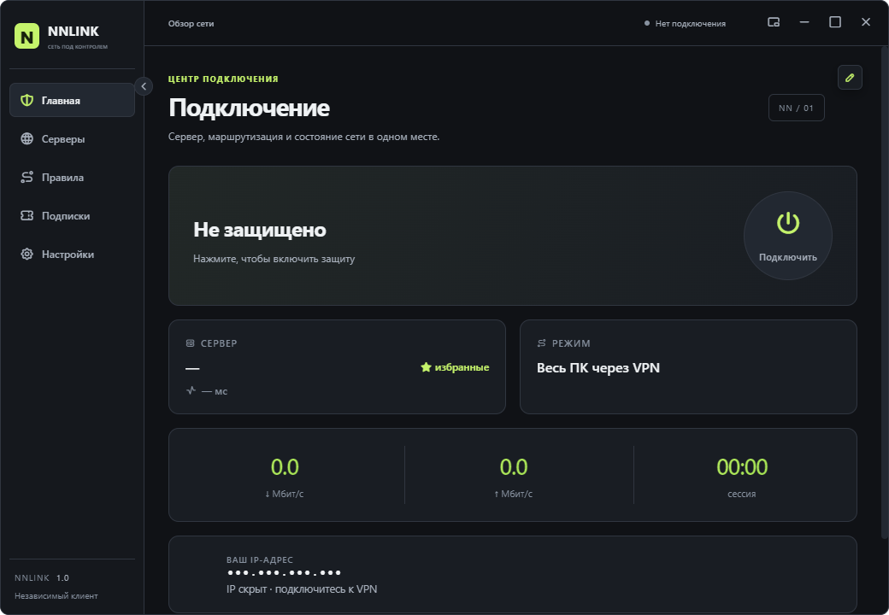

# NNLINK

### Сеть под вашим контролем

Самостоятельный клиент для Windows: ваши конфигурации, ваши серверы, ваши правила. Без обязательного аккаунта и привязки к одному провайдеру.

## Простое управление сетью

| Подписки и профили | Серверы и правила | Оформление |
| --- | --- | --- |
| Добавление ссылки или файла конфигурации. HWID выключен по умолчанию и настраивается для каждого источника. | Отдельные разделы для выбора сервера, избранного и собственных правил. | Тёмная, светлая и OLED-темы, прозрачность и компактное окно. |

## Локальные данные

Настройки, профили и журнал NNLINK находятся в `%APPDATA%\NNLINK`. Приложение не требует аккаунта NNLINK и не предоставляет собственные VPN-серверы. Ссылки подписок и конфигурации могут содержать ключи доступа — не прикладывайте их к публичным обращениям.

## Сторонние компоненты

Сетевое ядро основано на Mihomo. Права на него и другие сторонние компоненты определяются их собственными лицензиями; название и оформление NNLINK относятся к клиентскому приложению.
