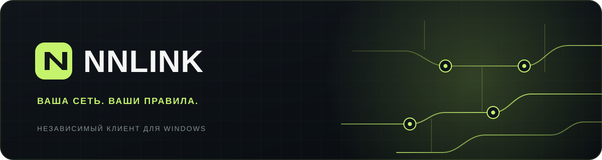
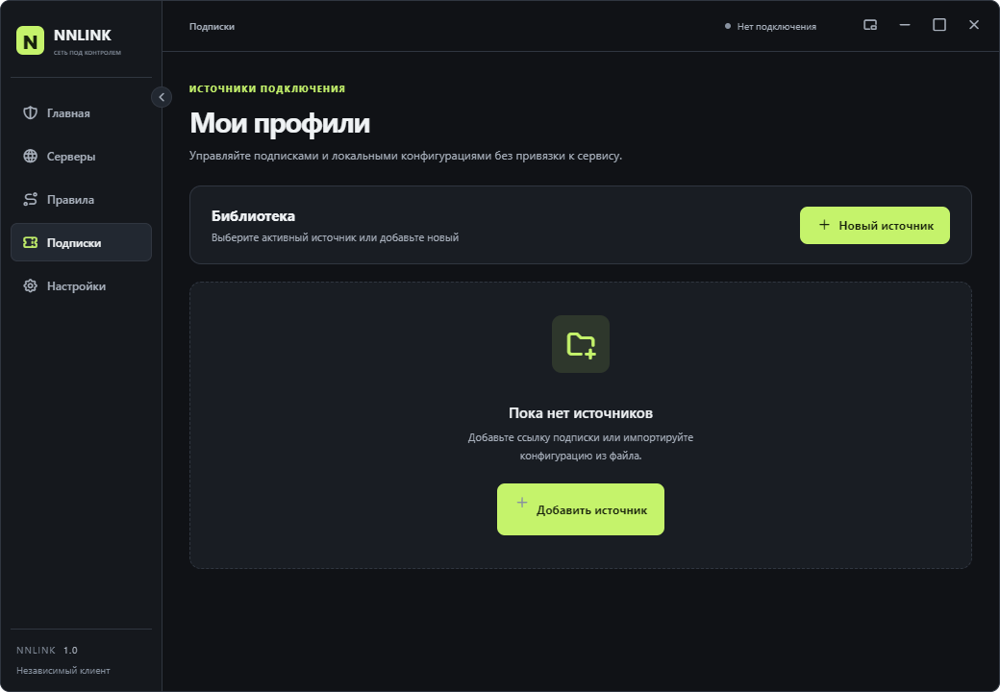
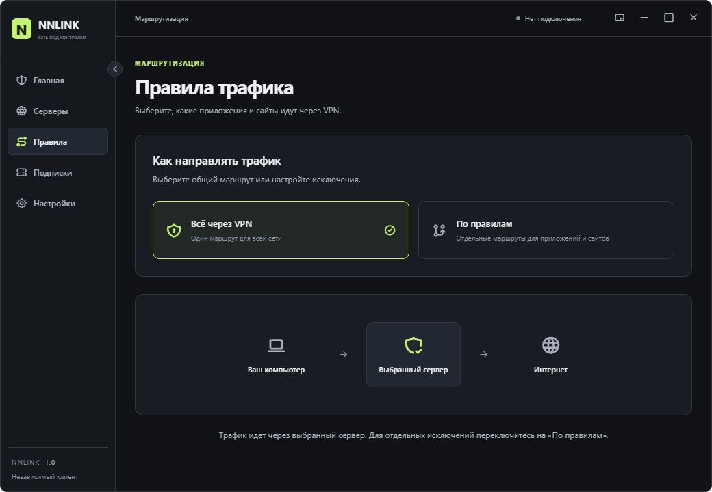
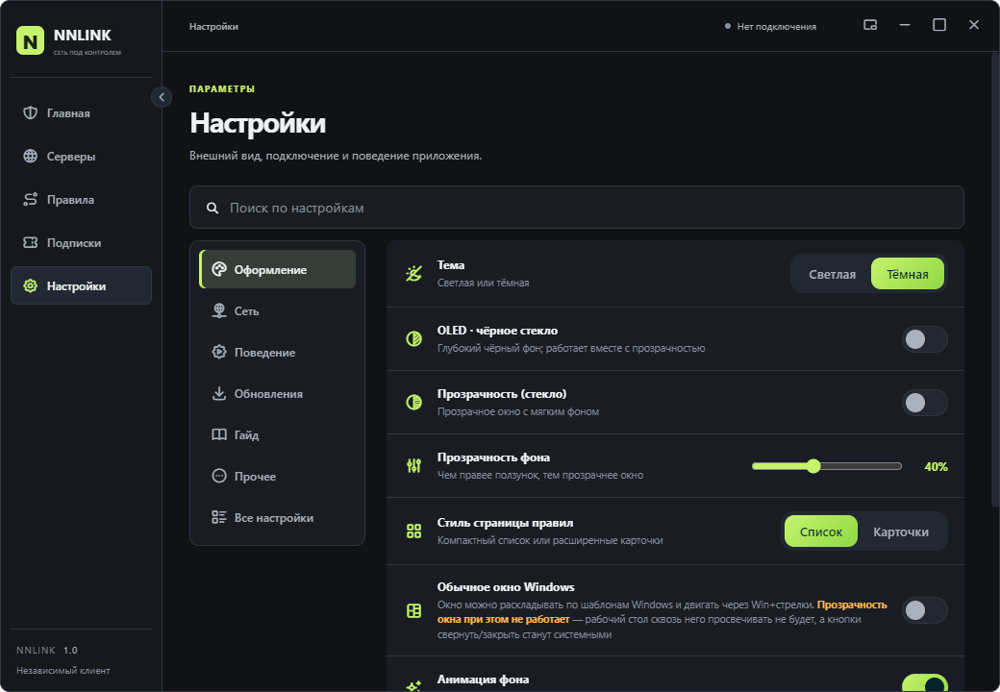

# NNLINK

**Самостоятельный сетевой клиент для Windows.** Подключайте свои конфигурации и подписки, выбирайте серверы и управляйте маршрутами без обязательного аккаунта и привязки к одному сервису.

[⬇️ Скачать последнюю версию](https://github.com/spikeefimov-gif/NNLINK-releases/releases/latest) · [⭐ Поставить звезду](https://github.com/spikeefimov-gif/NNLINK-releases) · [☕ Поддержать проект](https://pay.cloudtips.ru/p/9e6c8a09)

`Windows x64` · `Собственные профили` · `HWID выключен по умолчанию`

> [!IMPORTANT]
> NNLINK — клиент, а не VPN-сервис. Он не выдаёт серверы или подписки: для работы понадобится ваша конфигурация или ссылка от выбранного вами провайдера.

## Что умеет NNLINK

| Возможность | Как это устроено |
| --- | --- |
| Подписки и локальные профили | Добавляйте ссылку на подписку или импортируйте файл `.yaml`, `.yml`, `.json`, `.conf`. Источники собраны в одном разделе. |
| Серверы | Выбирайте узлы из своей конфигурации, ищите нужный сервер и добавляйте его в избранное. |
| Правила трафика | Используйте общий маршрут или задавайте правила для приложений, доменов и IP-адресов. |
| AmneziaWG 3.1 | Импортируйте `.conf` с параметрами AWG 3.1 или профиль YAML/JSON с `amnezia-wg-option`. |
| Оформление | Тёмная, светлая и OLED-темы, настройка прозрачности и компактное окно. |
| Контроль HWID | Передача идентификатора устройства отключена по умолчанию и включается отдельно для каждого источника, если этого требует провайдер. |

## Посмотрите интерфейс

Все кадры ниже сделаны в NNLINK. На них нет личных подписок или ключей.

<table>
  <tr>
    <td width="50%"> Главная — состояние подключения и быстрые действия</td>
    <td width="50%"> Подписки — ссылки и локальные конфигурации</td>
  </tr>
  <tr>
    <td width="50%"> Правила — маршруты для приложений и сайтов</td>
    <td width="50%"> Настройки — темы, прозрачность и поведение окна</td>
  </tr>
</table>

## Начать за три шага

1. **Скачайте NNLINK** с [официальной страницы выпусков](https://github.com/spikeefimov-gif/NNLINK-releases/releases/latest). Установите программу или запустите portable-версию.
2. **Добавьте свой источник** в разделе «Подписки»: вставьте ссылку или импортируйте файл. Если провайдер требует HWID, включите соответствующую галочку только для этого источника.
3. **Выберите сервер** в разделе «Серверы» и нажмите «Подключить» на главном экране. Режим и маршруты меняются в разделе «Правила».

### Какой файл скачать?

| Файл | Для чего |
| --- | --- |
| `NNLINK-Setup-*.exe` | Обычная установка Windows с ярлыком в меню «Пуск». |
| `NNLINK-Portable-*.exe` | Запуск без установки. |
| `SHA256SUMS.txt` | Проверка целостности скачанных файлов. |

Сборки пока не подписаны сертификатом издателя: Windows может показать предупреждение SmartScreen. Скачивайте файлы только из [GitHub Releases](https://github.com/spikeefimov-gif/NNLINK-releases/releases/latest) и при необходимости сверяйте SHA-256 с файлом выпуска.

## Вопросы и ответы

**Нужно ли создавать аккаунт NNLINK?** Нет. Приложение запускается без регистрации.

**Почему список серверов пуст?** NNLINK не предоставляет собственные серверы. Добавьте подписку или файл конфигурации — узлы появятся из вашего источника.

**Будет ли отправляться HWID?** По умолчанию нет. Включить передачу можно отдельно при добавлении или редактировании конкретной подписки.

**Где хранятся настройки?** Профили, настройки и журнал приложения находятся в `%APPDATA%\NNLINK`.

**Как получить новую версию?** Актуальный установщик и portable-файл находятся на странице [последнего выпуска](https://github.com/spikeefimov-gif/NNLINK-releases/releases/latest).

## Обратная связь

Нашли ошибку или есть идея? [Создайте Issue](https://github.com/spikeefimov-gif/NNLINK-releases/issues/new/choose) и напишите, что произошло, как повторить проблему и какая у вас версия Windows. Перед публикацией скриншотов и журналов удалите ссылки подписок, ключи доступа, HWID и другие личные данные.

Если NNLINK оказался полезен, **[поставьте ⭐ репозиторию](https://github.com/spikeefimov-gif/NNLINK-releases)** — это помогает другим людям найти проект. Поддержать разработку можно [добровольным донатом](https://pay.cloudtips.ru/p/9e6c8a09).
